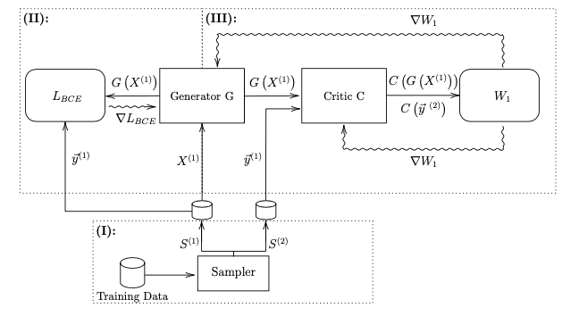

# FairML

This repository was created during my master thesis about fairness in machine learning. It consists of two modules:
* Metrics: Some metrics that are typically used to evaluate fairness  
* Models: Models that can be used to enforce algorithmic fairness

## Fair-WGAN

A proposal how one can enforce individual fairness, given a distance metric that captures the similarity between individuals/samples. The proposal includes a WGAN-like architecture, where the distance a-la-Wasserstein is computed between the generator output and the labels of the similar samples. The latter are provided by the so-called **Sampler**, which incoroprates the already mentioned distance metric. By default, the sampler uses the euclidean distance.

